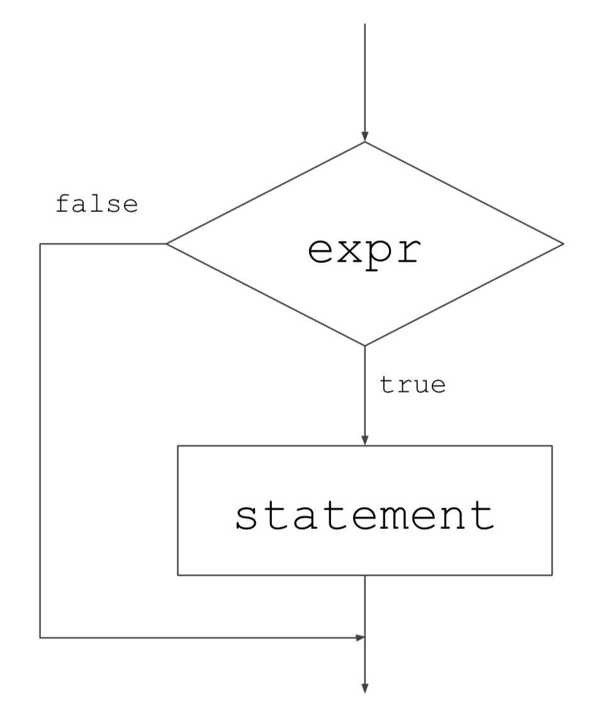
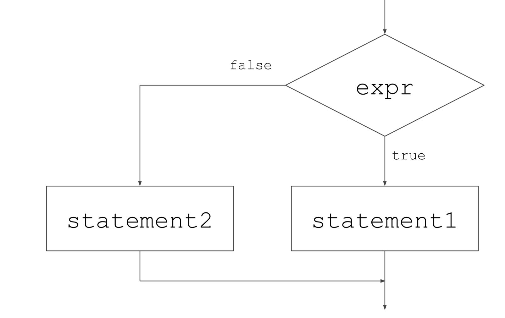
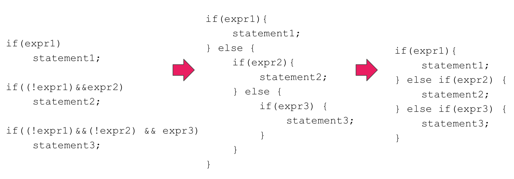
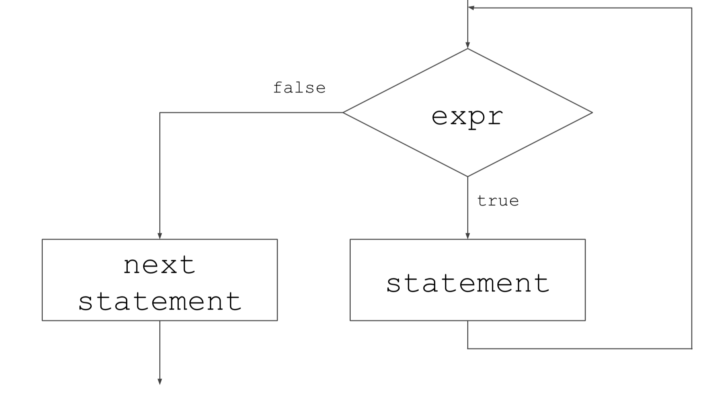

# Fourth Class

> ##if statement

> **if (expr)** 
>
> ​	**statement**

- **If expr is nonezero (true), then statement is executed; otherwise, statement is skipped.**



```c
#include <stdio.h>
int main(void) {
  int grade = 99;
  if (grade >= 90)
    printf("Congratulation!\n");
  printf("Your grade is %d\n", grade);
  return 0;
}
```

```c
#include <stdio.h>
int main(void) {
  int pass = 1;
  if (pass)
    printf("Congratulation!\n");
  printf("You are fail\n");
}
```

- **The expression in an if statement is a relational, equality or logical expression.**

```c
#include <stdio.h>
int main(void) {
  int x = 5, y = 5;
  int a = 5, b = 6, c = 7;
	if (y != 0)
    x /= y;
  if (a<b && b<c) {
    d = a+b+c;
    printf("Everything is in order.\n");
  }
  return 0;
}
```


> ## if-else statement

> **if (expr)**
>
> ​	**statement1**
>
> **else**
>
> ​	**statement2**

- **If expr is nonzero (ture), then statement1 is executed and statement2 is skipped; If expr is zero (false), then statement2 is executed.**



```c
#include <stdio.h>
int main(void) {
  int x = 3, y = 1;
  if (x<y) {
    min = x;
    printf("x is min value %d\n", x);
  } else {
    min = y;
    printf("y is min value %d\n", y);
  }
  return 0;
}
```


> If-else nested statement




> ## while ststement(loop)

> **while (expr)**
>
> ​	**statement**
>
> **next statement**

- **If expr is nonzero (true), then statement is executed and control is passed back to the beginning of while loop. while loop executed repeatedly until expr is zero (false).**



```c
#include <stdio.h>
int main(void) {
  int i=1, sum =0;
  while (i<=10) {
    sum += i;
    printf("i=%d, sum = %d\n", i, sum);
    i++;
  }
  return 0; //i = 1, 3, 6, 10 , ... , 45+10
}
```


