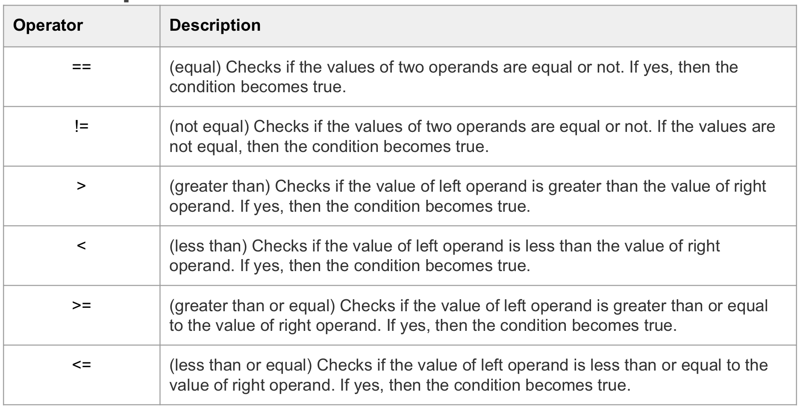
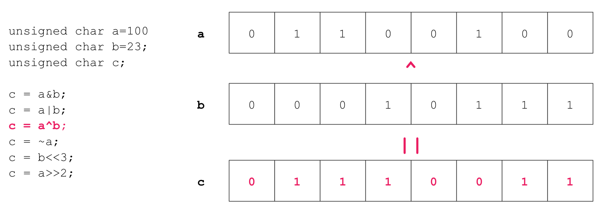

# Third Class


> #Constant


> (Symbolic) Constant

- Declare constant value

You can use const prefix to declare constants with a specific type.

```c
#include <stdio.h>

int main() {
  
  const int LENGTH = 10;
  const int WIDTH = 5;
  const char NEWLINE = '\n';
  int area;
  
  area = LENGTH * WIDTH;
  printf("vlaue of area : %d", area);
  printf("%c", NEWLINE);
  
  return 0;
}
```


> '#define' preprocessor

```c
#include <stdio.h>

#define LENGTH 10
#define WIDTH 5
#define NEWLINE '\n'

int main(void) {
  
  int area;
  
  area = LENGTH * WIDTH;
  ptintf("value of area : %d", area);
  printf("%c", NEWLINE);
  
  return 0;
}
```


> (Literal) Constants


- Integer literals 


**An integer literal can be**

-a decimal

-octal (prefix 0)

-or hexadecimal (prefix 0x or 0X)


Can have a suffix that is a combination of U and L, for unsigned and long,

Respectively. The suffix can be uppercase of lowercase and can be in any 

order.

> Example for lnteger literals


> String literals

- String is the "Arrsy of characters", ends with NULL ('\0') character.
- String literals or constants are enclosed in double quotes "".

```c
"Hello, dear"

"Hello, \

dear"

"Hello," "d" "ear"
```

```c
""

"    "

" a=b+c; "

" /* this is not comment*/ "

" double quotes \" "

" single backslash \\ "
```


> Scanf() & Scanf_s()

- scanf_s() is more secure than scanf().

​       Therefore, it's not supported in visual studio compiler. 

- Reads input for numbers and other datatypes from

  standard input '&' save it to variable.

``` c
#include <stdio.h>

int main(void) {
  int some_number;
  
  scanf("%d", &some_number);
  printf("some_number = %d\n", some_number);
  
  return 0;
}
```


> # Opreators

- Arithmetic Operators
- Relational Operators
- Logical Operators
- Bitwise Operators
- Assignment Operators
- Misc Operators


> Arithmetic operator


```c
int a = 100, b =23;
int c = 0;

c = a+b; //c=123
c = a-b; //c=77
c = a/b; //c=4
c = a%b; //c=8
c = a++; //c=101(x) c=100(o)
c = b--; //c=23
```

> +/- can be used as a sign

```c
int a=100, b=23;
int c=0;

c=-a; //c=-100
c=-b; //c=-23
```

> Increment & Decrement

```c
a++;				a--;
a = a+1;		a = a-1;
```

- Add or substract integer one from their operand(variable).

```c
#include <stdio.h>
int main(void){
  int a = 100, b = 23;
  int c = 0;
  c = ++a; // c=101, a=101
  c = a++; // c=101, a=102
  c = --a; // c=101, a=101
  c = a--; // c=101, a=100
}
```


>Relational operator



> Logical operator


```c
int a=1, b=0;
int c;

a&&b; //false
a||b; //true
!a;   //false
!b;   //true

c = ((a>b) && (a!=b)); //true
c = !(a==b); //true
```

> Example for c=a^b and c=~a




> Assignment operator


**(const)**


> Operator precedence


> Example of operator precedence

- Use '( )'

```c
(6/2) * (2+1) = 9
6 / (2 * (2+1)) = 1
```

- **Circuit Evaluation**

With expressions that contain the operands of && and ||,

the evaluation process stops as soon as the outcome 

true or false is known.

```c
if ((x>=0.0)) && sqrt(x) <= 7.7) {
  ...
}
```

if the value x is negative, the sqrt() is not taken.


> C++

- "C with Classes" was renamed to C++("++" being the increment operator in C).

